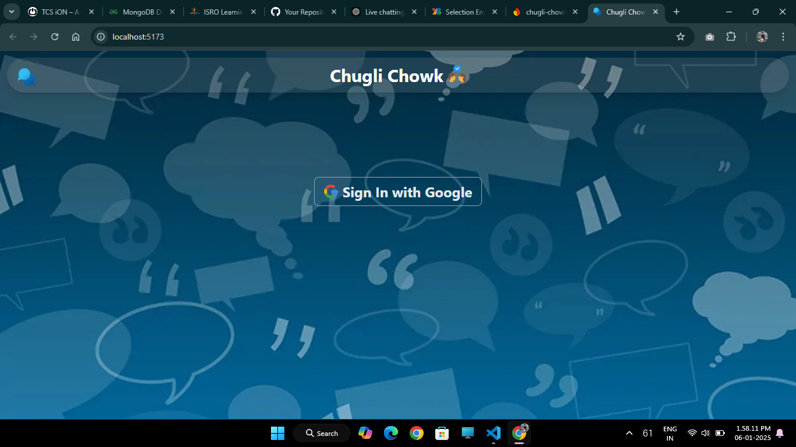
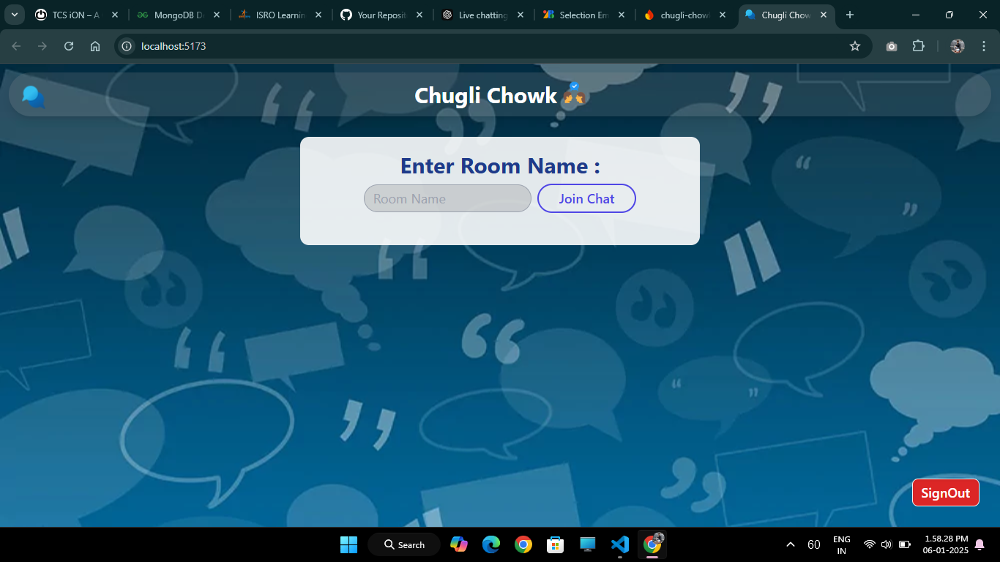
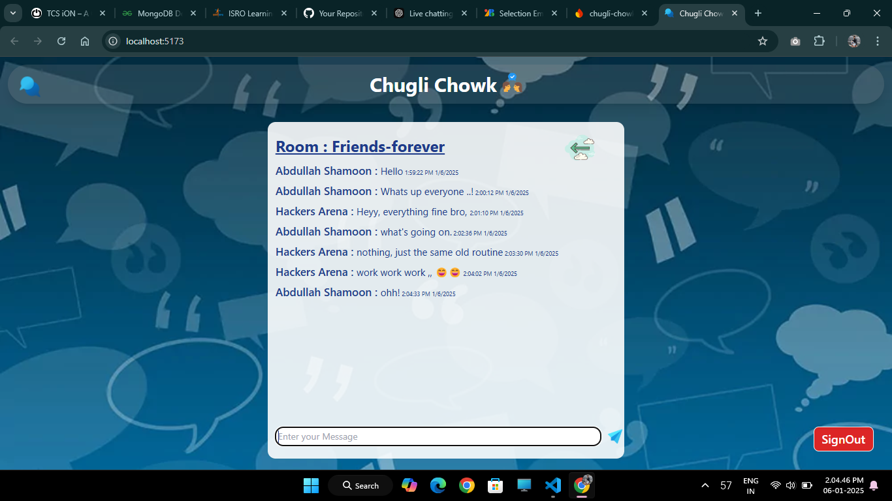

# Chugli Chowk

Chugli Chowk is a simple real-time group chat website that allows users to create or join groups using a unique group name. Users can chat with other group members in real-time. The application uses Firebase for backend functionality, including authentication and database storage.

## Features

- **Real-time Group Chat**: Users can send and receive messages instantly.
- **Group Creation and Joining**: Users can create or join any group by entering its unique name.
- **Firebase Authentication**: Login with Google using Firebase's OAuth provider.
- **Firestore Database**: Store and retrieve messages and group data efficiently.

## Tech Stack

- **Frontend**: React.js, Tailwind CSS
- **Backend**: Firebase
  - Firebase Authentication (Google OAuth)
  - Firestore (Database)

## Screenshots
<li>SignIn Page

 

<li>Join Room



<li>Chat (Room - Friends-forever)



## Getting Started

Follow these instructions to set up the project on your local machine.

### Prerequisites

- Node.js installed on your system
- Firebase account

### Installation

1. Clone the repository:

   ```bash
   git clone https://github.com/yourusername/chugli-chowk.git
   cd chugli-chowk
   ```

2. Install dependencies:

   ```bash
   npm install
   ```

3. Create a `.env` file in the root directory and add your Firebase configuration:

   ```env
   REACT_APP_FIREBASE_API_KEY=your_api_key_here
   REACT_APP_FIREBASE_AUTH_DOMAIN=your_auth_domain_here
   REACT_APP_FIREBASE_PROJECT_ID=your_project_id_here
   REACT_APP_FIREBASE_STORAGE_BUCKET=your_storage_bucket_here
   REACT_APP_FIREBASE_MESSAGING_SENDER_ID=your_sender_id_here
   REACT_APP_FIREBASE_APP_ID=your_app_id_here
   ```

4. Start the development server:

   ```bash
   npm start
   ```

   Open [http://localhost:3000](http://localhost:3000) in your browser.

## How It Works

1. **Login**: Users log in using their Google account.
2. **Create/Join a Group**: Enter a unique group name to create or join a group.
3. **Chat**: Start chatting with other members in real-time. Messages are stored in Firestore and synced across all connected clients.

## Folder Structure

```
Chugli-Chowk/
├── public/
├── src/
│   ├── components/         # Reusable React components
│   |   ├── Auth.jsx        # Authentication component
│   |   ├── Chat.jsx        # Chat component
│   |   ├── Navbar.jsx      # Navigation bar component
│   |   ├── Background.jsx  # Background component
│   ├── firebase-config.jsx # Firebase configuration
│   ├── pages/              # Main application pages
│   ├── App.jsx             # Root component
│   ├── index.jsx           # Entry point
├── .env                    # Environment variables
├── package.json            # Project metadata and dependencies
└── README.md               # Documentation
```

## Deployment

You can deploy the project using any hosting platform, such as:

- **Firebase Hosting**: Follow [Firebase Hosting documentation](https://firebase.google.com/docs/hosting).
- **Vercel**: Easily deploy your app by connecting your GitHub repository.
- **Netlify**: Another great option for hosting React apps.

## Future Enhancements

- **Direct Messaging**: Add support for private one-on-one chats.
- **Media Sharing**: Enable users to share images, videos, and files.
- **Notifications**: Real-time notifications for new messages.

## Contributing

Contributions are welcome! If you'd like to contribute, please fork the repository and submit a pull request.

1. Fork the repository
2. Create your feature branch (`git checkout -b feature/AmazingFeature`)
3. Commit your changes (`git commit -m 'Add some AmazingFeature'`)
4. Push to the branch (`git push origin feature/AmazingFeature`)
5. Open a pull request

## License

This project is licensed under the MIT License. See the `LICENSE` file for details.

## Acknowledgments

- [Firebase](https://firebase.google.com/) for backend services
- [React.js](https://reactjs.org/) for the frontend framework
- Special thanks to anyone who uses or contributes to the project!

---

Feel free to contact me for any questions or feedback!
